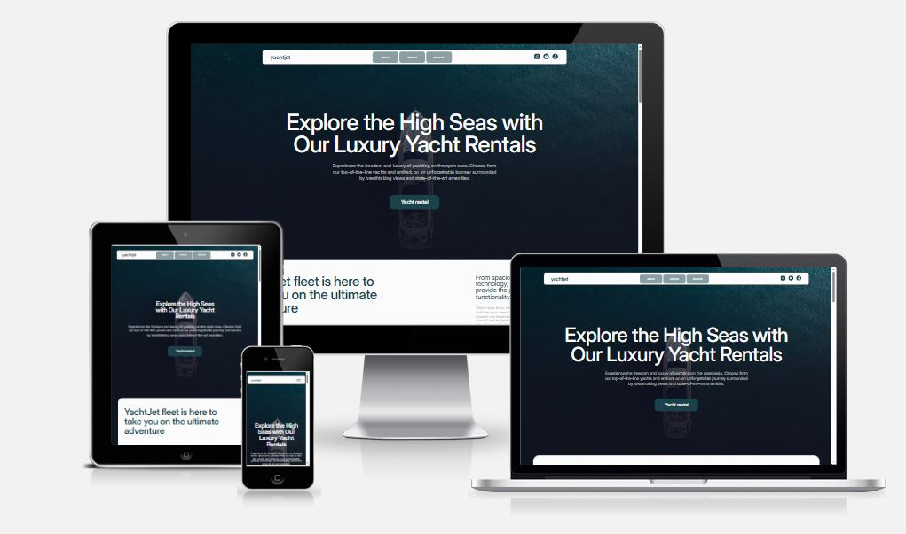

# Yacht Rental Website

**Team Project (7 Developers)**

- **Volodymyr Buhlak**
- **Oksana Semenchuk**
- **Akim Duvanov**
- **Anhelina Pushkash**
- **Iryna Kozhemyakina**
- **Inna Melnyk**
- **Yulia Snisar**

---

## 📌 Overview

This is a **one-page website** for yacht rental services. The site allows users
to explore available yachts, view rental options, and easily get in touch for
bookings. It is designed with a **mobile-first approach**, ensuring smooth
usability across **mobile, tablet, and desktop** devices.

The project is built using **vanilla JavaScript, HTML, and CSS**.

---

## 🛠️ Tech Stack

---

## 🌐 Tools & Platforms

---

## 🎯 Key Features

- **Yacht Listings** — showcase of available yachts with images and details
- **Rental Options** — information about pricing and booking conditions
- **Contact Section** — easy communication for rental inquiries
- **Responsive Design**

---

## 📸 Screenshot

